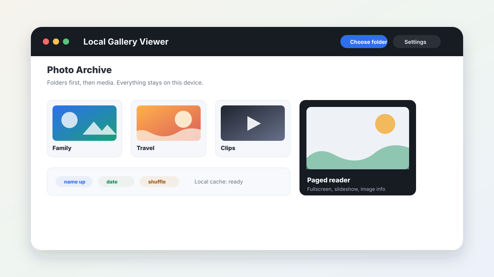

# Local Gallery Viewer

> Open a folder and turn it into a private, full-screen media gallery. No upload,
> no account, no build step.

[](#tech-stack)
[](#privacy)
[](#setup)

Local Gallery Viewer is a lightweight browser app for browsing image and video
folders directly from your machine. It is built for personal archives, photo
drives, manga/comic folders, design references, and any collection where you
want quick visual navigation without importing files into another service.



## Why It Exists

Most gallery tools make you choose between convenience and privacy. This project
keeps both: point the browser at a folder, browse nested albums, open media in a
reader, and keep everything on the device. The entire app is three product files:
`index.html`, `styles.css`, and `app.js`.

## Features

- **Local folder browsing** with the File System Access API in Chrome and Edge.
- **Firefox and Safari fallback** through directory input selection.
- **Mixed-content galleries** that show folders and loose media together.
- **Generated cover thumbnails** for folders, images, videos, and SVG files.
- **IndexedDB thumbnail cache** with bounded LRU eviction and a clear-cache
  control.
- **Reader modes** for vertical scroll, page-by-page viewing, and slideshow.
- **Slideshow wake lock** where supported, so long sessions do not dim the
  screen.
- **Drag-and-drop folder opening** in browsers that expose folder handles.
- **Persistent preferences** for density, sort order, reader width, snap
  scrolling, slideshow timing, and default reader mode.
- **Accessible keyboard navigation** with roving grid focus, focus traps,
  labelled controls, visible focus states, and live region announcements.
- **Privacy-first design**: folder names, file contents, and thumbnails stay in
  your browser.

## Tech Stack

| Layer | Details |
| --- | --- |
| Runtime | Browser-only HTML, CSS, and JavaScript |
| Storage | IndexedDB for thumbnails, preferences, and recent folders |
| File access | File System Access API, with directory-input fallback |
| Media | Native image/video elements and canvas thumbnail generation |
| Build | None |
| Dependencies | None |

## Setup

1. Clone or download the repository.
2. Keep `index.html`, `styles.css`, and `app.js` in the same folder.
3. Open `index.html` in Chrome or Edge.
4. Choose a folder and start browsing.

Chrome or Edge is recommended for lazy reads, recent folders, and drag-and-drop
folder handles. Firefox and Safari can still browse selected folders through the
fallback picker, but those browsers read the selected directory up front and do
not support one-click recent folders.

## Usage

- Click **Choose a folder** to open a local directory.
- Click a folder card to drill into it, or click a media card to open the
  reader at that item.
- Use settings to change density, reading width, sort order, reader mode,
  slideshow interval, and cache controls.
- Drop a folder onto the page in Chrome/Edge to open it immediately.
- Use the reader controls for fullscreen, download, image info, slideshow, and
  scroll/page mode switching.

### Keyboard Shortcuts

| Key | Action |
| --- | --- |
| `Esc` | Close reader or settings |
| `Arrow keys` | Move through the gallery grid |
| `Home` / `End` | Jump to first or last grid item |
| `Enter` / `Space` | Open the focused card |
| `Backspace` | Go up one folder |
| `Left` / `Right` | Previous or next item in paged mode |
| `Space` | Next page, or scroll down in scroll mode |
| `m` | Toggle scroll/page reader mode |
| `s` | Toggle slideshow |
| `f` | Toggle fullscreen |
| `i` | Toggle image info in paged mode |

## Privacy

All browsing happens locally. The app does not upload files, thumbnails, folder
names, or usage data. Browser storage is used only for preferences, recent
folder handles where supported, and generated thumbnail cache entries. The cache
can be cleared from **Settings -> Thumbnail cache**.

## Project Structure

```text
.
|-- index.html          # Markup and controls
|-- styles.css          # Layout, theme, responsive states
|-- app.js              # Folder access, rendering, reader, cache, preferences
|-- IMPROVEMENTS.md     # Shipped roadmap notes and deferred ideas
`-- docs/
    `-- gallery-preview.svg
```

## Testing

There is no automated test suite yet. For release checks, open `index.html` and
verify these paths manually:

1. Choose a folder with nested folders, images, videos, and loose files.
2. Navigate into and out of folders with mouse and keyboard.
3. Open the reader in scroll and paged modes.
4. Toggle slideshow, fullscreen, image info, sort order, density, and cache
   controls.
5. Reopen the app and confirm preferences and recent folders persist in
   Chrome/Edge.
6. Try the directory picker fallback in Firefox or Safari.

## Deployment

The app is static and can be hosted anywhere that serves files: GitHub Pages,
Netlify, Vercel, an internal static server, or a local filesystem. No build
command is required.

## Roadmap

The main planned improvements are intentionally small and product-facing:

- Zoom and pan for large paged images.
- A shortcut-help overlay.
- Optional screenshot fixtures and browser smoke tests.

See [IMPROVEMENTS.md](./IMPROVEMENTS.md) for the shipped implementation notes
and deferred work.

## License

No license file is currently included. Add one before accepting outside
contributions or redistributing the project broadly.
